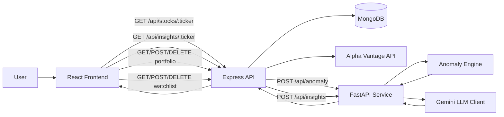
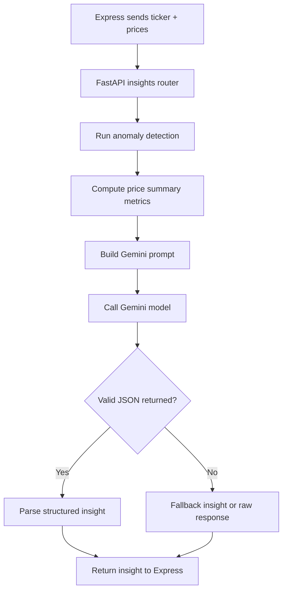
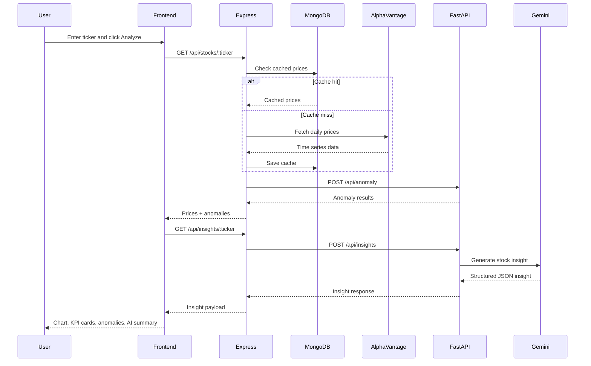

# Pulse AI Stock Intelligence Dashboard

## Overview

Pulse AI is a full-stack stock intelligence dashboard that combines:
- **real-time or cached stock price retrieval** from Alpha Vantage,
- **technical anomaly detection** using a Python microservice,
- **AI-generated market commentary** using Google Gemini,
- **portfolio tracking** with live mark-to-market calculations,
- **watchlist management** with mini sparkline previews.

The project is split into three major parts:

1. **Frontend** – React + Vite dashboard UI
2. **Node.js backend** – Express API + MongoDB persistence
3. **Python backend** – FastAPI service for anomaly detection and AI insight generation

---

## High-Level Architecture



---

## Directory Structure

```text
Pulse-AI-Stock-Intelligence-Dashboard/
├── backend/
│   ├── express/
│   │   ├── index.js
│   │   ├── models/
│   │   │   ├── CatchedPrices.js
│   │   │   ├── Portfolio.js
│   │   │   └── Watchlist.js
│   │   ├── routes/
│   │   │   ├── insights.js
│   │   │   ├── portfolio.js
│   │   │   ├── stocks.js
│   │   │   └── watchlist.js
│   │   ├── services/
│   │   │   └── alphaVantage.js
│   │   └── scripts/
│   │       └── seedCache.js
│   └── python/
│       ├── main.py
│       ├── routers/
│       │   ├── anomaly.py
│       │   └── insights.py
│       └── services/
│           ├── anomaly_engine.py
│           └── llm_client.py
├── frontend/
│   └── src/
│       ├── App.jsx
│       ├── utils/api.js
│       └── components/
│           ├── AIInsightCard.jsx
│           ├── AnomalyTable.jsx
│           ├── KPICard.jsx
│           ├── PortfolioPieChart.jsx
│           ├── PortfolioTracker.jsx
│           ├── StockChart.jsx
│           └── WatchlistSidebar.jsx
└── README.md
```

---

## How the Codebase Works

## 1) Frontend Layer

The frontend is built with **React + Vite** and acts as the main user-facing dashboard.

### Main entry points
- `frontend/src/main.jsx` bootstraps the React app.
- `frontend/src/App.jsx` is the central container for the dashboard.
- `frontend/src/utils/api.js` defines Axios API helpers.

### Core UI responsibilities
- Search for a ticker and trigger analysis
- Show KPI cards for latest price, daily change, anomaly count, and data source
- Render a price chart with anomaly markers
- Display AI-generated market insight
- Manage a user watchlist
- Manage portfolio holdings and allocation visualization

### Important frontend components

#### `App.jsx`
This is the orchestration layer for the UI.

It:
- stores the selected ticker,
- triggers stock fetch and AI insight fetch,
- manages loading and error states,
- switches between **Dashboard** and **Portfolio** tabs,
- passes data into presentational components.

#### `StockChart.jsx`
Uses **Recharts** to render the closing-price trend for the last 30 trading days.

It also:
- formats dates for chart labels,
- shows OHLC + volume in a custom tooltip,
- highlights anomaly dates with red `ReferenceDot` markers.

#### `AIInsightCard.jsx`
Displays:
- trend classification,
- risk level,
- 2-sentence summary,
- price target hint,
- key observation.

If the Gemini call fails or quota is hit, the backend may return a computed fallback insight, which this card still renders.

#### `AnomalyTable.jsx`
Renders anomaly rows with:
- date,
- close price,
- % move,
- z-score,
- severity,
- direction.

#### `WatchlistSidebar.jsx`
Supports:
- add ticker,
- remove ticker,
- select ticker for dashboard analysis,
- quick performance preview with mini sparklines.

#### `PortfolioTracker.jsx`
Supports:
- add holding,
- remove holding,
- fetch latest holding metrics,
- compute and display overall P&L summary,
- render a portfolio allocation pie chart.

#### `PortfolioPieChart.jsx`
Uses **Recharts PieChart** to visualize holding allocation by current value.

---

## 2) Express Backend Layer

The Node.js backend is the main API gateway between the frontend, MongoDB, Alpha Vantage, and the FastAPI service.

### Entry file
- `backend/express/index.js`

### Responsibilities
- Expose REST endpoints for stock analysis, insights, portfolio, and watchlist
- Connect to MongoDB with Mongoose
- Fetch market data from Alpha Vantage
- Forward price data to FastAPI for anomaly detection and AI insights
- Persist watchlist, portfolio, and cached prices

### Mounted routes
- `/api/stocks` → stock price retrieval + anomaly analysis
- `/api/insights` → AI insight generation
- `/api/portfolio` → portfolio CRUD + enrichment
- `/api/watchlist` → watchlist CRUD + enrichment
- `/health` → service health check

### Route details

#### `routes/stocks.js`
Flow:
1. Validate ticker symbol.
2. Fetch daily prices using `getDailyPrices()`.
3. Slice the latest 30 trading days.
4. Send those prices to FastAPI `/api/anomaly`.
5. Return prices + anomaly result to frontend.

**Note:** In the current code, the anomaly response is called but not assigned back into the `anamolies` array, so the frontend may receive an empty anomaly list even if FastAPI detects anomalies. This is an implementation gap worth fixing.

#### `routes/insights.js`
Flow:
1. Fetch the latest daily prices.
2. Normalize numeric fields.
3. Send the last 30 days to FastAPI `/api/insights`.
4. Return structured AI insight data.
5. If FastAPI fails, return a safe fallback response.

This route is more defensive and better instrumented than the stock route.

#### `routes/portfolio.js`
Provides:
- `GET /api/portfolio` → returns holdings and aggregated summary
- `POST /api/portfolio` → adds a holding
- `DELETE /api/portfolio/:id` → removes a holding

For each stored holding, the route fetches the latest market data and computes:
- current price,
- current value,
- total cost,
- P&L,
- P&L percentage.

#### `routes/watchlist.js`
Provides:
- `GET /api/watchlist` → list watchlist items with price, day change, sparkline data
- `POST /api/watchlist` → add or upsert a ticker
- `DELETE /api/watchlist/:ticker` → remove a ticker

---

## 3) Alpha Vantage Data Service

### File
- `backend/express/services/alphaVantage.js`

### Responsibilities
- Call Alpha Vantage daily time-series endpoint
- Transform raw API response into normalized objects
- Cache the result in MongoDB
- Return demo data when API quota/rate limit is reached

### Returned price shape
```js
{
  date,
  open,
  high,
  low,
  close,
  volume
}
```

### Fallback logic
If Alpha Vantage returns a `Note` or `Information` field, the code switches to **generated demo price data**. This prevents the UI from completely failing when API limits are hit.

---

## 4) MongoDB Models

### `models/CatchedPrices.js`
Stores cached daily prices by ticker.

Intended behavior:
- one document per ticker,
- TTL-based auto-expiry after about 1 hour.

### `models/Portfolio.js`
Stores:
- ticker,
- shares,
- buy price,
- buy date,
- timestamp.

### `models/Watchlist.js`
Stores unique tickers for the user watchlist.

---

## 5) FastAPI Python Service

The Python service handles the analytics/AI side of the platform.

### Entry file
- `backend/python/main.py`

### Mounted routers
- `/api/anomaly`
- `/api/insights`
- `/health`

### Why a separate Python service?
Because Python is a natural fit for analytics logic, statistical processing, and AI/ML integration. The Express service uses it like a specialized analytics engine.

---

## 6) Anomaly Detection Flow

### Files
- `backend/python/routers/anomaly.py`
- `backend/python/services/anomaly_engine.py`

### Process
1. Receive ticker + price series from Express.
2. Compute day-over-day percent changes.
3. Calculate mean and standard deviation of changes.
4. Compute z-score for each day.
5. Flag days with `|z-score| > 2.0` as anomalies.
6. Mark severity:
   - `MEDIUM` if `|z| > 2`
   - `HIGH` if `|z| > 3`
7. Classify direction:
   - `SPIKE UP`
   - `DROP DOWN`

### Output fields
Each anomaly may contain:
- date
- close
- prev_close
- pct_change
- z_score
- severity
- direction
- reason

## 7) AI Insight Generation Flow

### Files
- `backend/python/routers/insights.py`
- `backend/python/services/llm_client.py`

### Process
1. Receive ticker + recent prices.
2. Re-run anomaly detection for context.
3. Compute summary features:
   - start price,
   - end price,
   - overall change,
   - 30-day high,
   - 30-day low,
   - average volume.
4. Build a structured prompt.
5. Send prompt to **Google Gemini**.
6. Expect a JSON-only response.
7. Parse JSON and return to Express.
8. If parsing fails or quota is exceeded, return a fallback computed insight.

### Expected LLM output shape
```json
{
  "trend": "Bullish | Bearish | Neutral",
  "risk_level": "Low | Medium | High",
  "price_target_hint": "brief one-line price expectation",
  "summary": "2-sentence explanation",
  "key_observation": "specific pattern insight"
}
```

### Flow chart: insight generation



---

## End-to-End Request Flow

### Dashboard analysis flow



---

## API Surface Summary

### Express API

#### Stock endpoints
- `GET /api/stocks/:ticker`
- `GET /api/insights/:ticker`

#### Portfolio endpoints
- `GET /api/portfolio`
- `POST /api/portfolio`
- `DELETE /api/portfolio/:id`

#### Watchlist endpoints
- `GET /api/watchlist`
- `POST /api/watchlist`
- `DELETE /api/watchlist/:ticker`

#### Health
- `GET /health`

### FastAPI endpoints
- `POST /api/anomaly`
- `POST /api/insights`
- `GET /health`

---

## Tech Stack

### Frontend
- React
- Vite
- Axios
- Recharts
- react-sparklines
- Tailwind CSS

### Backend
- Node.js
- Express
- Mongoose
- MongoDB
- Axios

### Python Service
- FastAPI
- Pydantic
- Google Generative AI SDK
- python-dotenv

### External Services
- Alpha Vantage
- Google Gemini

---
